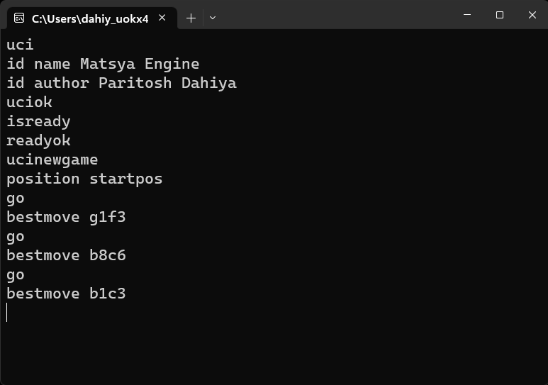

# Matsya Chess Engine 🐟

This is a simple ♟️chess engine written in Python.
Run the `matsya.exe` from the `output` folder to play against the engine or load it in any GUI.

## Inspiration

I really like chess and I always wanted to make a chess engine myself. We all have played chess with popular engines like Stockfish, Komodo, etc. and this is just a humble attempt to make a chess engine myself.

## What is does

- This engine is compatible with `UCI` protocol (basics) and can be used with GUIs like `Arena` and `Cutechess`.

- `Python-chess` library is used for board representation and move generation.  

- `Alpha-beta pruning` is used for move search.

- A `Neural Network` was also trained to evaluate the board using `PyTorch` but it was not used in the final version as the engine was not strong enough, probably due to lack of training data.

- `Piece-square tables` are used for the evaluation function. It is based on the `PeSTO` and `Rofchade` engines by `Ronald Friederich`.  

- `Tapered evaluation` is used to reduce the horizon effect between the middle game and the end game.

## Challenges I ran into

- Implementation of the UCI protocol was a bit challenging.  

- The performance of the Neural Network was not good enough as the training data used was very less and the network was not trained for enough time.

- Lots of bugs occurred while writing the code for Alpha-beta pruning.

## What have I learned

- I learned about the UCI protocol and how to implement it.

- I learned about how various chess engines work and how to make one.

## What's next for Matsya Chess Engine

- I will try to improve the performance of the engine by using a better evaluation function and a better move search algorithm.

- I will try to train the neural network for more time and with more data and eventually replicate the results of the Stockfish evaluation function.

- Refactor the code.

## Screenshots

- Matsya Engine Playing against itself in Arena GUI

- CLI of Matsya Engine

## Built with

- Love 💖
- Python 🐍
- PyTorch 🔥
- Python-Chess ♟️

Leave a ⭐ if you like it.

## License
